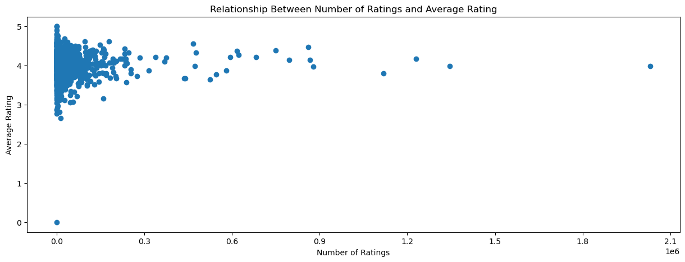

# Data 200: Data Systems for Data Analytics


# Name:

# Take Home Final Exam
<font color='red'>**Due Date:** Dec 20, 5p (T-F 1:30p section) </font> <br>
<font color='red' style="margin-left: 1.85cm; display: inline-block;">Dec 21, 11:59a (T-F 3p section)</font>

---

### **Task**: Scrape data from Goodreads.com 📚

---

### **Objective**
For this exam, you will scrape and analyze data from Goodreads.com. The work is split into two parts, each focusing on different aspects of the data
1. **"Best Books" Analysis**: Explore Goodreads' "Best Books" lists for a specific year.
2. **Author-Level Analysis**: Study the trends and patterns in the works of a specific author.

---

### **Instructions**

#### **Task 1: Best Books**
You are tasked with analyzing Goodreads' "Best Books" lists for a specific year based on the **first letter of your first name**. For example, if your first name starts with **A–E**, you are assigned to the year **2023**; if it starts with **F–J**, you are assigned to **2022**, and so on:

| Initials | Assigned Year | URL                                              |
|----------|---------------|---------------------------------------------------------|
| A–E      | 2023          | [Best Books of 2023](https://www.goodreads.com/list/best_of_year/2023) |
| F–J      | 2022          | [Best Books of 2022](https://www.goodreads.com/list/best_of_year/2022) |
| K–O      | 2021          | [Best Books of 2021](https://www.goodreads.com/list/best_of_year/2021) |
| P–T      | 2020          | [Best Books of 2020](https://www.goodreads.com/list/best_of_year/2020) |
| U–Z      | 2019          | [Best Books of 2019](https://www.goodreads.com/list/best_of_year/2019) |


**Your Tasks**:
1. Scrape data from the Goodreads "Best Books of [Year]" list:
   - **URL**: https://www.goodreads.com/list/best_of_year/2023 (replace the year with your assigned year). You can also use the table above.
2. Collect the following data for each book:
   - Title
   - Publication date (first published)
   - Author
   - Genre (if available, and feel free to pick the first genre listed)
   - Average rating
   - Number of ratings
   - Number of pages
   - Rank
   - Language (if available)
   - Number of people who are currently reading (if available)
   - Number of people who want to read (if available)
3. Perform the following analyses:
   - **Genre ratings**:
       - Compare average ratings across genres. Which 2-3 genres tends to have the highest ratings? Create a table showing average rating score, and average rank by genre.
   - **Popularity and ratings**:
       - Examine whether books with more ratings tend to have higher or lower average scores. Create a scatterplot showing the relationship between the number of ratings and average rating. On the x-axis, you should have **number of ratings**; on the y-axis, you should have **average rating**.

---

#### **Task 2: Author-Level Analysis**
You are now tasked with analyzing books by a specific author based on the **first letter of your first name**:

| Your first name initial | Author              | Author Goodreads link                               | Birthday       |
|----------|---------------------|--------------------------------------------------------------------|----------------|
| A–E      | Stephen King        | [Stephen King](https://www.goodreads.com/author/list/3389)         | Sep 21, 1947   |
| F–J      | George R.R. Martin  | [George R.R. Martin](https://www.goodreads.com/author/list/346732) | Sep 20, 1948   |
| K–O      | Ernest Hemingway    | [Ernest Hemingway](https://www.goodreads.com/author/list/1455)     | Jul 21, 1899   |
| P–T      | Neil Gaiman         | [Neil Gaiman](https://www.goodreads.com/author/list/1221698)       | Nov 10, 1960   |
| U–Z      | Nora Roberts        | [Nora Roberts](https://www.goodreads.com/author/list/625)          | Oct 10, 1950   |


**Your Tasks**:
1. Scrape all books by your assigned author:
   - Use the link provided for your author.
2. Collect the following data for each book:
   - Title
   - Publication date (first published)
   - Author
   - Genre (if available, and feel free to pick the first genre listed)
   - Average rating
   - Number of ratings
   - Number of pages
   - Rank (from the books written by the author)
   - Language (if available)
   - Number of people who are currently reading (if available)
   - Number of people who want to read (if available)
3. Perform the following analyses:
   - **Language Distribution**:
     - How many books has the author published in English? In other languages? Create a table showing the count of books by language.
   - **Author's Age and Page Count**:
     - Do authors tend to write longer books as they age? Use the author's birthday to calculate their age at the time of each book's publication. Create a line plot with **author's age** on the x-axis and **page count** on the y-axis.
   - **Author's Age and Rating**:
     - For English-only books, create a line plot with **author's age** on the x-axis and **average rating** on the y-axis.
     - Repeat the analysis including books in languages other than English. Does your interpretation change?
   - **Pages vs. Ratings**:
     - Is there a relationship between the number of pages and a book's average rating? Create a scatterplot with **page count** on the x-axis and **average rating** on the y-axis.
   - **Interest on a book**:
     - Is there a relationship between the number of people who are currently reading the book and the number of people who left a rating? Create a scatterplot with **number of people who are currently reading** on the x-axis and **number of ratings** on the y-axis. Create a second scatterplot with **average rating** on the y-axis. Do books with more interest tend to receive higher ratings?

---

### **Submission Requirements**
Submit your work as a single `.ipynb` file, along with a copy of it as a `.md` file. The notebook should include:
1. **Code**:
   - Well-documented python code using Selenium for web scraping.
   - Proper error handling and strategies for dynamic content.
2. **Cleaned Data**:
   - Include the cleaned datasets from both tasks as .csv files. You can upload them in your github repo.
3. **Analysis and Report**:
   - Present your findings using markdown cells, tables, and visualizations you make in python.
   - Address all questions posed for your assigned tasks.
4. **Visualizations**:
   - Include relevant charts (e.g., bar charts, line plots, scatterplots) to support your conclusions.

---

### **Rubric**

| Item                        | Weight |
|-----------------------------|--------|
| Code accuracy               | 25%    |
| Code clarity and annotation | 25%    |
| Exploratory data analysis   | 25%    |
| Discussion of findings      | 25%    |

---

### **Tips**
- Make sure to insert time.sleep() right after you request driver to go to a link (before requesting elements). Make sure to wait at least 0.7 second, or even slightly higher if you run into issues.
- Try-except blocks will be your friend because xpath positions on a page may differ depending on the book and content availability.

---

### **Resources**
- Course notes on Github
- Selenium documentation: https://www.selenium.dev/documentation/
- Pandas documentation: https://pandas.pydata.org/docs/
- Matplotlib documentation: https://matplotlib.org/stable/contents.html

Good luck! 🏁


# Question 1


```python
!pip install selenium
```

    Collecting selenium
      Downloading selenium-4.27.1-py3-none-any.whl.metadata (7.1 kB)
    Requirement already satisfied: urllib3<3,>=1.26 in c:\users\prana\anaconda3\lib\site-packages (from urllib3[socks]<3,>=1.26->selenium) (2.2.2)
    Collecting trio~=0.17 (from selenium)
      Downloading trio-0.27.0-py3-none-any.whl.metadata (8.6 kB)
    Collecting trio-websocket~=0.9 (from selenium)
      Downloading trio_websocket-0.11.1-py3-none-any.whl.metadata (4.7 kB)
    Requirement already satisfied: certifi>=2021.10.8 in c:\users\prana\anaconda3\lib\site-packages (from selenium) (2024.12.14)
    Requirement already satisfied: typing_extensions~=4.9 in c:\users\prana\anaconda3\lib\site-packages (from selenium) (4.11.0)
    Requirement already satisfied: websocket-client~=1.8 in c:\users\prana\anaconda3\lib\site-packages (from selenium) (1.8.0)
    Collecting attrs>=23.2.0 (from trio~=0.17->selenium)
      Downloading attrs-24.3.0-py3-none-any.whl.metadata (11 kB)
    Requirement already satisfied: sortedcontainers in c:\users\prana\anaconda3\lib\site-packages (from trio~=0.17->selenium) (2.4.0)
    Requirement already satisfied: idna in c:\users\prana\anaconda3\lib\site-packages (from trio~=0.17->selenium) (3.7)
    Collecting outcome (from trio~=0.17->selenium)
      Downloading outcome-1.3.0.post0-py2.py3-none-any.whl.metadata (2.6 kB)
    Requirement already satisfied: sniffio>=1.3.0 in c:\users\prana\anaconda3\lib\site-packages (from trio~=0.17->selenium) (1.3.0)
    Requirement already satisfied: cffi>=1.14 in c:\users\prana\anaconda3\lib\site-packages (from trio~=0.17->selenium) (1.16.0)
    Collecting wsproto>=0.14 (from trio-websocket~=0.9->selenium)
      Downloading wsproto-1.2.0-py3-none-any.whl.metadata (5.6 kB)
    Requirement already satisfied: pysocks!=1.5.7,<2.0,>=1.5.6 in c:\users\prana\anaconda3\lib\site-packages (from urllib3[socks]<3,>=1.26->selenium) (1.7.1)
    Requirement already satisfied: pycparser in c:\users\prana\anaconda3\lib\site-packages (from cffi>=1.14->trio~=0.17->selenium) (2.21)
    Requirement already satisfied: h11<1,>=0.9.0 in c:\users\prana\anaconda3\lib\site-packages (from wsproto>=0.14->trio-websocket~=0.9->selenium) (0.14.0)
    Downloading selenium-4.27.1-py3-none-any.whl (9.7 MB)
       ---------------------------------------- 0.0/9.7 MB ? eta -:--:--
        --------------------------------------- 0.2/9.7 MB 4.6 MB/s eta 0:00:03
       - -------------------------------------- 0.4/9.7 MB 4.6 MB/s eta 0:00:03
       -- ------------------------------------- 0.6/9.7 MB 4.8 MB/s eta 0:00:02
       --- ------------------------------------ 0.9/9.7 MB 5.3 MB/s eta 0:00:02
       ---- ----------------------------------- 1.2/9.7 MB 5.3 MB/s eta 0:00:02
       ------ --------------------------------- 1.5/9.7 MB 5.2 MB/s eta 0:00:02
       ------- -------------------------------- 1.7/9.7 MB 5.5 MB/s eta 0:00:02
       -------- ------------------------------- 2.0/9.7 MB 5.5 MB/s eta 0:00:02
       --------- ------------------------------ 2.3/9.7 MB 5.7 MB/s eta 0:00:02
       ---------- ----------------------------- 2.6/9.7 MB 5.5 MB/s eta 0:00:02
       ----------- ---------------------------- 2.9/9.7 MB 5.8 MB/s eta 0:00:02
       ------------ --------------------------- 3.2/9.7 MB 5.7 MB/s eta 0:00:02
       -------------- ------------------------- 3.4/9.7 MB 5.7 MB/s eta 0:00:02
       --------------- ------------------------ 3.7/9.7 MB 5.7 MB/s eta 0:00:02
       ---------------- ----------------------- 4.0/9.7 MB 5.8 MB/s eta 0:00:01
       ----------------- ---------------------- 4.3/9.7 MB 5.8 MB/s eta 0:00:01
       ------------------ --------------------- 4.5/9.7 MB 5.8 MB/s eta 0:00:01
       ------------------- -------------------- 4.8/9.7 MB 5.8 MB/s eta 0:00:01
       -------------------- ------------------- 5.0/9.7 MB 5.7 MB/s eta 0:00:01
       --------------------- ------------------ 5.2/9.7 MB 5.6 MB/s eta 0:00:01
       ---------------------- ----------------- 5.4/9.7 MB 5.6 MB/s eta 0:00:01
       ----------------------- ---------------- 5.6/9.7 MB 5.5 MB/s eta 0:00:01
       ------------------------ --------------- 5.9/9.7 MB 5.5 MB/s eta 0:00:01
       ------------------------ --------------- 6.1/9.7 MB 5.5 MB/s eta 0:00:01
       ------------------------- -------------- 6.3/9.7 MB 5.4 MB/s eta 0:00:01
       -------------------------- ------------- 6.5/9.7 MB 5.4 MB/s eta 0:00:01
       --------------------------- ------------ 6.7/9.7 MB 5.4 MB/s eta 0:00:01
       ---------------------------- ----------- 7.0/9.7 MB 5.4 MB/s eta 0:00:01
       ----------------------------- ---------- 7.3/9.7 MB 5.4 MB/s eta 0:00:01
       ------------------------------- -------- 7.5/9.7 MB 5.4 MB/s eta 0:00:01
       -------------------------------- ------- 7.8/9.7 MB 5.4 MB/s eta 0:00:01
       --------------------------------- ------ 8.0/9.7 MB 5.4 MB/s eta 0:00:01
       ---------------------------------- ----- 8.3/9.7 MB 5.4 MB/s eta 0:00:01
       ----------------------------------- ---- 8.6/9.7 MB 5.4 MB/s eta 0:00:01
       ----------------------------------- ---- 8.7/9.7 MB 5.4 MB/s eta 0:00:01
       ------------------------------------- -- 9.0/9.7 MB 5.4 MB/s eta 0:00:01
       -------------------------------------- - 9.3/9.7 MB 5.4 MB/s eta 0:00:01
       ---------------------------------------  9.5/9.7 MB 5.4 MB/s eta 0:00:01
       ---------------------------------------  9.7/9.7 MB 5.3 MB/s eta 0:00:01
       ---------------------------------------- 9.7/9.7 MB 5.2 MB/s eta 0:00:00
    Downloading trio-0.27.0-py3-none-any.whl (481 kB)
       ---------------------------------------- 0.0/481.7 kB ? eta -:--:--
       ---------- ----------------------------- 122.9/481.7 kB 7.5 MB/s eta 0:00:01
       ---------- ----------------------------- 122.9/481.7 kB 7.5 MB/s eta 0:00:01
       ------------------- -------------------- 235.5/481.7 kB 1.8 MB/s eta 0:00:01
       ---------------------------------------  481.3/481.7 kB 2.7 MB/s eta 0:00:01
       ---------------------------------------- 481.7/481.7 kB 2.3 MB/s eta 0:00:00
    Downloading trio_websocket-0.11.1-py3-none-any.whl (17 kB)
    Downloading attrs-24.3.0-py3-none-any.whl (63 kB)
       ---------------------------------------- 0.0/63.4 kB ? eta -:--:--
       ---------------------------------------- 63.4/63.4 kB 1.7 MB/s eta 0:00:00
    Downloading wsproto-1.2.0-py3-none-any.whl (24 kB)
    Downloading outcome-1.3.0.post0-py2.py3-none-any.whl (10 kB)
    Installing collected packages: wsproto, attrs, outcome, trio, trio-websocket, selenium
      Attempting uninstall: attrs
        Found existing installation: attrs 23.1.0
        Uninstalling attrs-23.1.0:
          Successfully uninstalled attrs-23.1.0
    Successfully installed attrs-24.3.0 outcome-1.3.0.post0 selenium-4.27.1 trio-0.27.0 trio-websocket-0.11.1 wsproto-1.2.0
    


```python
from selenium import webdriver
from selenium.webdriver.support.ui import WebDriverWait
from selenium.webdriver.support import expected_conditions as EC
from selenium.webdriver.common.by import By
from selenium.webdriver.common.action_chains import ActionChains
from selenium.common.exceptions import StaleElementReferenceException
import pandas as pd
import numpy as np
import matplotlib.pyplot as plt

```


```python
driver = webdriver.Chrome() #creates a webdriver for chrome
```


```python
driver.get('https://www.goodreads.com/list/best_of_year/2020?id=143444.Best_Books_of_2020&page=1') #opens the website to work on

```


```python
#getting all the links of the books, that are being used as data.
book_links = []
for i in range(1,17):
    st = f'https://www.goodreads.com/list/best_of_year/2020?id=143444.Best_Books_of_2020&page={i}'
    driver.get(st)
    a = driver.find_elements('xpath','//*[contains(@class,"bookTitle")]') #find all the element which has links for books
    for j in a:
        book_links.append(j.get_attribute('href')) #extracts the actual links from the references

```


```python
lists = book_links #create a sample list
```


```python
list1 = list(dict.fromkeys(book_links)) #get rid of all the duplicates
```


```python
#function for getting the title of the book
def getTitle():
    try:
        a = driver.find_element('xpath', '//*[@id="__next"]/div[2]/main/div[1]/div[2]/div[2]/div[1]/div[1]/h1').text
        return a
    except:
        return None

#function to get the Publication date
def getPdate():
    try: #tries different div classes for the publication date
        b = driver.find_element('xpath', '//*[@id="__next"]/div[2]/main/div[1]/div[2]/div[2]/div[2]/div[7]/div/span[1]/span/div/p[2]').text
        b = b[16:] #It get rid of all extra text with the date
        return b
    except:
        try: #tries different div classes for the publication date
            b = driver.find_element('xpath', '//*[@id="__next"]/div[2]/main/div[1]/div[2]/div[2]/div[2]/div[6]/div/span[1]/span/div/p[2]').text
            b = b[16:] #It get rid of all extra text with the date
            return b
        except: 
            try: #tries different div classes for the publication date
                b = driver.find_element('xpath', '//*[@id="__next"]/div[2]/main/div[1]/div[2]/div[2]/div[2]/div[5]/div/span[1]/span/div/p[2]').text
                b = b[16:] #It get rid of all extra text with the date
                return b
            except: 
                try: #tries different div classes for the publication date
                    b = driver.find_element('xpath', '//*[@id="__next"]/div[2]/main/div[1]/div[2]/div[2]/div[2]/div[4]/div/span[1]/span/div/p[2]').text
                    b = b[16:] #It get rid of all extra text with the date
                    return b 
                except:
                    try: #tries different div classes for the publication date
                        b = driver.find_element('xpath', '//*[@id="__next"]/div[2]/main/div[1]/div[2]/div[2]/div[2]/div[8]/div/span[1]/span/div/p[2]').text
                        b = b[16:] #It get rid of all extra text with the date
                        return b
                    except:
                        return None

#function to get the author of the book
def getAuthor():
    try:
        c = driver.find_element('xpath', '//*[@id="__next"]/div[2]/main/div[1]/div[2]/div[2]/div[2]/div[1]/h3/div/span[1]/a/span[1]').text
        return c
    except:
        return None

#function to get the genre of the book
def getGenre():
    try: #check if book has a displayed genre
        d = driver.find_element('xpath', '//*[@id="__next"]/div[2]/main/div[1]/div[2]/div[2]/div[2]/div[6]/ul/span[1]/span[2]/a/span').text
        return d 
    except: #if Genre is not mentioned then return None
        try: #check if book has a displayed genre
            d = driver.find_element('xpath', '//*[@id="__next"]/div[2]/main/div[1]/div[2]/div[2]/div[2]/div[5]/ul/span[1]/span[2]/a/span').text
            return d
        except:
            try: #check if book has a displayed genre
                d = driver.find_element('xpath', '//*[@id="__next"]/div[2]/main/div[1]/div[2]/div[2]/div[2]/div[4]/ul/span[1]/span[2]/a/span').text
                return d
            except:
                try: #check if book has a displayed genre
                    d = driver.find_element('xpath', '//*[@id="__next"]/div[2]/main/div[1]/div[2]/div[2]/div[2]/div[7]/ul/span[1]/span[2]/a/span').text
                    return d
                except:
                    try: #check if book has a displayed genre
                        d = driver.find_element('xpath', '//*[@id="__next"]/div[2]/main/div[1]/div[2]/div[2]/div[2]/div[8]/ul/span[1]/span[2]/a/span').text
                        return d
                    except:
                        return None
            

#function to get the average rating of the book
def getAvg_rating():
    try:
        e = driver.find_element('xpath', '//*[@id="__next"]/div[2]/main/div[1]/div[2]/div[2]/div[2]/div[2]/a/div[1]/div').text
        return e
    except:
        return None
        

#function to get the number os ratings a book has recieved 
def getNumofrating():
    try:
        f = driver.find_element('xpath', '//*[@id="__next"]/div[2]/main/div[1]/div[2]/div[2]/div[2]/div[2]/a/div[2]/div/span[1]').text
        f = f[-9::-1] #trims the text to get reversed number of ratings
        f = f[-1::-1] #reverse the sting again for reading
        return f
    except:
        return None

#function to get the number of pages in the book
def getNumofpages():
    try: #tries different div classes for the publication date
        g = driver.find_element('xpath', '//*[@id="__next"]/div[2]/main/div[1]/div[2]/div[2]/div[2]/div[7]/div/span[1]/span/div/p[1]').text
        g1 = g.split(" ")
        g = g1[0]
        return g
    except:
        try: #tries different div classes for the publication date
            g = driver.find_element('xpath', '//*[@id="__next"]/div[2]/main/div[1]/div[2]/div[2]/div[2]/div[6]/div/span[1]/span/div/p[1]').text
            g1 = g.split(" ")
            g = g1[0]
            return g
        except: 
            try: #tries different div classes for the publication date
                g = driver.find_element('xpath', '//*[@id="__next"]/div[2]/main/div[1]/div[2]/div[2]/div[2]/div[5]/div/span[1]/span/div/p[1]').text
                g1 = g.split(" ")
                g = g1[0]
                return g
            except: 
                try: #tries different div classes for the publication date
                    g = driver.find_element('xpath', '//*[@id="__next"]/div[2]/main/div[1]/div[2]/div[2]/div[2]/div[4]/div/span[1]/span/div/p[1]').text
                    g1 = g.split(" ")
                    g = g1[0]
                    return g
                except:
                    try: #tries different div classes for the publication date
                        g = driver.find_element('xpath', '//*[@id="__next"]/div[2]/main/div[1]/div[2]/div[2]/div[2]/div[8]/div/span[1]/span/div/p[1]').text
                        g1 = g.split(" ")
                        g = g1[0]
                        return g
                    except:
                        return None


#function to get the language of the book
def getLanguage(): 
    try: #tries different div classes for the publication date
        h1= driver.find_element('xpath', '//*[@id="__next"]/div[2]/main/div[1]/div[2]/div[2]/div[2]/div[7]/div/div/button')
        actions = ActionChains(driver)
        actions.move_to_element(h1).click().perform()
    except:
        try: #tries different div classes for the publication date
            h1= driver.find_element('xpath', '//*[@id="__next"]/div[2]/main/div[1]/div[2]/div[2]/div[2]/div[6]/div/div/button')
            actions = ActionChains(driver)
            actions.move_to_element(h1).click().perform()
        except: 
            try: #tries different div classes for the publication date
                h1= driver.find_element('xpath', '//*[@id="__next"]/div[2]/main/div[1]/div[2]/div[2]/div[2]/div[5]/div/div/button')
                actions = ActionChains(driver)
                actions.move_to_element(h1).click().perform()
            except: 
                try: #tries different div classes for the publication date
                    h1= driver.find_element('xpath', '//*[@id="__next"]/div[2]/main/div[1]/div[2]/div[2]/div[2]/div[4]/div/div/button')
                    actions = ActionChains(driver)
                    actions.move_to_element(h1).click().perform()
                except:
                    try: #tries different div classes for the publication date
                        h1= driver.find_element('xpath', '//*[@id="__next"]/div[2]/main/div[1]/div[2]/div[2]/div[2]/div[8]/div/div/button')
                        actions = ActionChains(driver)
                        actions.move_to_element(h1).click().perform()
                    except:
                        return None
    xpaths = [
        '//*[@id="__next"]/div[2]/main/div[1]/div[2]/div[2]/div[2]/div[7]/div/span[2]/div[1]/span/div/dl/div[5]/dd/div/div[1]',
        '//*[@id="__next"]/div[2]/main/div[1]/div[2]/div[2]/div[2]/div[6]/div/span[2]/div[1]/span/div/dl/div[5]/dd/div/div[1]',
        '//*[@id="__next"]/div[2]/main/div[1]/div[2]/div[2]/div[2]/div[5]/div/span[2]/div[1]/span/div/dl/div[5]/dd/div/div[1]',
        '//*[@id="__next"]/div[2]/main/div[1]/div[2]/div[2]/div[2]/div[8]/div/span[2]/div[1]/span/div/dl/div[5]/dd/div/div[1]',
        '//*[@id="__next"]/div[2]/main/div[1]/div[2]/div[2]/div[2]/div[7]/div/span[2]/div[1]/span/div/dl/div[4]/dd/div/div[1]',
        '//*[@id="__next"]/div[2]/main/div[1]/div[2]/div[2]/div[2]/div[6]/div/span[2]/div[1]/span/div/dl/div[4]/dd/div/div[1]',
        '//*[@id="__next"]/div[2]/main/div[1]/div[2]/div[2]/div[2]/div[5]/div/span[2]/div[1]/span/div/dl/div[4]/dd/div/div[1]',
        '//*[@id="__next"]/div[2]/main/div[1]/div[2]/div[2]/div[2]/div[8]/div/span[2]/div[1]/span/div/dl/div[4]/dd/div/div[1]',
        '//*[@id="__next"]/div[2]/main/div[1]/div[2]/div[2]/div[2]/div[7]/div/span[2]/div[1]/span/div/dl/div[3]/dd/div/div[1]',
        '//*[@id="__next"]/div[2]/main/div[1]/div[2]/div[2]/div[2]/div[6]/div/span[2]/div[1]/span/div/dl/div[3]/dd/div/div[1]',
        '//*[@id="__next"]/div[2]/main/div[1]/div[2]/div[2]/div[2]/div[5]/div/span[2]/div[1]/span/div/dl/div[3]/dd/div/div[1]',
        '//*[@id="__next"]/div[2]/main/div[1]/div[2]/div[2]/div[2]/div[8]/div/span[2]/div[1]/span/div/dl/div[3]/dd/div/div[1]',
        '//*[@id="__next"]/div[2]/main/div[1]/div[2]/div[2]/div[2]/div[7]/div/span[2]/div[1]/span/div/dl/div[6]/dd/div/div[1]',
        '//*[@id="__next"]/div[2]/main/div[1]/div[2]/div[2]/div[2]/div[6]/div/span[2]/div[1]/span/div/dl/div[6]/dd/div/div[1]',
        '//*[@id="__next"]/div[2]/main/div[1]/div[2]/div[2]/div[2]/div[5]/div/span[2]/div[1]/span/div/dl/div[6]/dd/div/div[1]',
        '//*[@id="__next"]/div[2]/main/div[1]/div[2]/div[2]/div[2]/div[8]/div/span[2]/div[1]/span/div/dl/div[6]/dd/div/div[1]',
        '//*[@id="__next"]/div[2]/main/div[1]/div[2]/div[2]/div[2]/div[7]/div/span[2]/div[1]/span/div/dl/div[7]/dd/div/div[1]',
        '//*[@id="__next"]/div[2]/main/div[1]/div[2]/div[2]/div[2]/div[6]/div/span[2]/div[1]/span/div/dl/div[7]/dd/div/div[1]',
        '//*[@id="__next"]/div[2]/main/div[1]/div[2]/div[2]/div[2]/div[5]/div/span[2]/div[1]/span/div/dl/div[7]/dd/div/div[1]',
        '//*[@id="__next"]/div[2]/main/div[1]/div[2]/div[2]/div[2]/div[8]/div/span[2]/div[1]/span/div/dl/div[7]/dd/div/div[1]'
    ]

    for xpath in xpaths:
        try:
            h = driver.find_element('xpath', xpath)
            driver.execute_script("arguments[0].scrollIntoView(true);", h)
            text = h.text
            return text
        except Exception:
            continue
    return None

#function to get the number of people currently reading
def getNumofcur():
    try: #check if book has a displayed number of current readers
        i1 = driver.find_element('xpath', '//*[@id="__next"]/div[2]/main/div[1]/div[2]/div[2]/div[2]/div[8]/div/div[1]/span/div[2]/div').text
        i2 = i1.split(" ") #splits the string by spaces
        i1 = i2[0] #get rid of the extra text
        return i1
    except: #if current readers is not mentioned then return None
        try: #check if book has a displayed number of current readers
            i1 = driver.find_element('xpath', '//*[@id="__next"]/div[2]/main/div[1]/div[2]/div[2]/div[2]/div[7]/div/div[1]/span/div[2]/div').text
            i2 = i1.split(" ") #splits the string by spaces
            i1 = i2[0] #get rid of the extra text
            return i1
        except: #if current readers is not mentioned then return None
            try: #check if book has a displayed number of current readers
                i1 = driver.find_element('xpath', '//*[@id="__next"]/div[2]/main/div[1]/div[2]/div[2]/div[2]/div[6]/div/div[1]/span/div[2]/div').text
                i2 = i1.split(" ") #splits the string by spaces
                i1 = i2[0] #get rid of the extra text
                return i1
            except: #if current readers is not mentioned then return None
                try: #check if book has a displayed number of current readers
                    i1 = driver.find_element('xpath', '//*[@id="__next"]/div[2]/main/div[1]/div[2]/div[2]/div[2]/div[9]/div/div[1]/span/div[2]/div').text
                    i2 = i1.split(" ") #splits the string by spaces
                    i1 = i2[0] #get rid of the extra text
                    return i1
                except: #if current readers is not mentioned then return None
                    return None

#function to get the number of people already read 
def getPeopleread():
    try: #check if book has a displayed number of people read
        j1 = driver.find_element('xpath', '//*[@id="__next"]/div[2]/main/div[1]/div[2]/div[2]/div[2]/div[8]/div/div[2]/span/div[2]/div').text
        j2 = j1.split(" ")
        j1 = j2[0] #get rid of the extra text
        return j1
    except: #if people read is not mentioned then return None
        try: #check if book has a displayed number of people read
            j1 = driver.find_element('xpath', '//*[@id="__next"]/div[2]/main/div[1]/div[2]/div[2]/div[2]/div[7]/div/div[2]/span/div[2]/div').text
            j2 = j1.split(" ")
            j1 = j2[0] #get rid of the extra text
            return j1
        except: #if people read is not mentioned then return None
            try: #check if book has a displayed number of people read
                j1 = driver.find_element('xpath', '//*[@id="__next"]/div[2]/main/div[1]/div[2]/div[2]/div[2]/div[6]/div/div[2]/span/div[2]/div').text
                j2 = j1.split(" ")
                j1 = j2[0] #get rid of the extra text
                return j1
            except: #if people read is not mentioned then return None
                try: #check if book has a displayed number of people read
                    j1 = driver.find_element('xpath', '//*[@id="__next"]/div[2]/main/div[1]/div[2]/div[2]/div[2]/div[9]/div/div[2]/span/div[2]/div').text
                    j2 = j1.split(" ")
                    j1 = j2[0] #get rid of the extra text
                    return j1
                except: #if people read is not mentioned then return None
                    return None


```


```python
#make an empty list for every data column
title = []
publication_date = []
author = []
genre = []
average_rating = []
num_of_ratings = []
num_of_pages = []
language = []
current_readers = []
already_read = [] #wrong name of column but changed further in the project
for l in list1:
    driver.get(l) #get the book webpage
    title.append(getTitle()) #get the title of books
    publication_date.append(getPdate()) #get the publication date of books
    author.append(getAuthor()) #get the author of books
    genre.append(getGenre()) #get the genre of books
    average_rating.append(getAvg_rating()) #get the average rating of books
    num_of_ratings.append(getNumofrating()) #get the number of ratings of books
    num_of_pages.append(getNumofpages()) #get the number of pages of books
    current_readers.append(getNumofcur()) #get the current readers of books
    already_read.append(getPeopleread()) #get the number people who already read of books
    language.append(getLanguage()) #get the language of books
```


```python
rank = []
for i in range(1,17):
    st = f'https://www.goodreads.com/list/best_of_year/2020?id=143444.Best_Books_of_2020&page={i}'
    driver.get(st)
    a = driver.find_elements('xpath','//*[contains(@class,"number")]') #find all the element which has links for books
    for j in a:
        rank.append(j.text) #extracts the actual links from the references

```


```python
books = pd.DataFrame({'title' : title,
                      'publication_date' : publication_date,
                      'author' : author, 
                      'genre' : genre,
                      'average_rating' : average_rating, 
                      'num_of_ratings' : num_of_ratings, 
                      'num_of_pages' : num_of_pages,
                      'rank' : rank,
                      'language' : language,
                      'current_readers' : current_readers,
                      'already_read' : already_read
                     })
```


```python
books.to_csv("Bestbooks2020.csv", index = False)
```

# Task 1

#### Compare average ratings across genres. Which 2-3 genres tends to have the highest ratings? Create a table showing average rating score, and average rank by genre.


```python
df = pd.read_csv('Bestbooks2020.csv', encoding = "ISO-8859-1")
```


```python
df = df.rename(columns={'already_read': 'want_to_read'}) #changing of the wrong name of the column
```


```python
result = df.groupby('genre')[['average_rating', 'rank']].mean().rename(columns={'average_rating': 'avg_rating', 'rank': 'avg_rank'})
result.sort_values(by = 'avg_rating', ascending = False)
```


<div>
<style scoped>
    .dataframe tbody tr th:only-of-type {
        vertical-align: middle;
    }

    .dataframe tbody tr th {
        vertical-align: top;
    }

    .dataframe thead th {
        text-align: right;
    }
</style>
<table border="1" class="dataframe">
  <thead>
    <tr style="text-align: right;">
      <th></th>
      <th>avg_rating</th>
      <th>avg_rank</th>
    </tr>
    <tr>
      <th>genre</th>
      <th></th>
      <th></th>
    </tr>
  </thead>
  <tbody>
    <tr>
      <th>Self Help</th>
      <td>4.640000</td>
      <td>689.000000</td>
    </tr>
    <tr>
      <th>Nature</th>
      <td>4.560000</td>
      <td>1338.000000</td>
    </tr>
    <tr>
      <th>Time Travel</th>
      <td>4.540000</td>
      <td>516.000000</td>
    </tr>
    <tr>
      <th>Biblical Fiction</th>
      <td>4.503333</td>
      <td>782.666667</td>
    </tr>
    <tr>
      <th>Childrens</th>
      <td>4.500000</td>
      <td>1076.000000</td>
    </tr>
    <tr>
      <th>...</th>
      <td>...</td>
      <td>...</td>
    </tr>
    <tr>
      <th>Fiction</th>
      <td>3.780684</td>
      <td>718.957895</td>
    </tr>
    <tr>
      <th>Film</th>
      <td>3.750000</td>
      <td>1514.000000</td>
    </tr>
    <tr>
      <th>Horror</th>
      <td>3.702222</td>
      <td>713.138889</td>
    </tr>
    <tr>
      <th>Philosophy</th>
      <td>3.630000</td>
      <td>422.000000</td>
    </tr>
    <tr>
      <th>China</th>
      <td>2.880000</td>
      <td>593.000000</td>
    </tr>
  </tbody>
</table>
<p>81 rows × 2 columns</p>
</div>


# Observations

#### The data shows 81 different genres in the whole database. The table shows unique genres with their average rating and average rankings. Among those genres we see that "Self Help", "Nature" and "Time Travel" are at the top with the highest ratings of 4.64, 4.56 and 4.54 respctively.

# Conclusion

#### From the observation, the top 3 genres with the highest average ratings are "Self Help", "Nature" and "Time Travel".

---

# Task 2

#### Examine whether books with more ratings tend to have higher or lower average scores. Create a scatterplot showing the relationship between the number of ratings and average rating. On the x-axis, you should have number of ratings; on the y-axis, you should have average rating.


```python
df['num_of_ratings'] = df['num_of_ratings'].fillna('0')  # Replace None values with '0'
df['num_of_ratings'] = df['num_of_ratings'].str.replace(',', '').astype(int) #Getting rid of commas from the numbers
trend = df[['title', 'num_of_ratings', 'average_rating']].sort_values(by = 'num_of_ratings', ascending= False)
trend.head(20).reset_index()
```


<div>
<style scoped>
    .dataframe tbody tr th:only-of-type {
        vertical-align: middle;
    }

    .dataframe tbody tr th {
        vertical-align: top;
    }

    .dataframe thead th {
        text-align: right;
    }
</style>
<table border="1" class="dataframe">
  <thead>
    <tr style="text-align: right;">
      <th></th>
      <th>index</th>
      <th>title</th>
      <th>num_of_ratings</th>
      <th>average_rating</th>
    </tr>
  </thead>
  <tbody>
    <tr>
      <th>0</th>
      <td>4</td>
      <td>The Midnight Library</td>
      <td>2030733</td>
      <td>3.99</td>
    </tr>
    <tr>
      <th>1</th>
      <td>6</td>
      <td>Beach Read</td>
      <td>1344851</td>
      <td>3.99</td>
    </tr>
    <tr>
      <th>2</th>
      <td>2</td>
      <td>The Invisible Life of Addie LaRue</td>
      <td>1229885</td>
      <td>4.18</td>
    </tr>
    <tr>
      <th>3</th>
      <td>12</td>
      <td>The Guest List</td>
      <td>1118263</td>
      <td>3.81</td>
    </tr>
    <tr>
      <th>4</th>
      <td>8</td>
      <td>The Ballad of Songbirds and Snakes</td>
      <td>878860</td>
      <td>3.97</td>
    </tr>
    <tr>
      <th>5</th>
      <td>78</td>
      <td>The Inheritance Games</td>
      <td>866242</td>
      <td>4.14</td>
    </tr>
    <tr>
      <th>6</th>
      <td>1</td>
      <td>House of Earth and Blood</td>
      <td>860457</td>
      <td>4.47</td>
    </tr>
    <tr>
      <th>7</th>
      <td>5</td>
      <td>The Vanishing Half</td>
      <td>794599</td>
      <td>4.14</td>
    </tr>
    <tr>
      <th>8</th>
      <td>0</td>
      <td>The House in the Cerulean Sea</td>
      <td>748874</td>
      <td>4.39</td>
    </tr>
    <tr>
      <th>9</th>
      <td>59</td>
      <td>From Blood and Ash</td>
      <td>682385</td>
      <td>4.22</td>
    </tr>
    <tr>
      <th>10</th>
      <td>595</td>
      <td>Good Girl, Bad Blood</td>
      <td>622958</td>
      <td>4.28</td>
    </tr>
    <tr>
      <th>11</th>
      <td>3</td>
      <td>American Dirt</td>
      <td>617385</td>
      <td>4.37</td>
    </tr>
    <tr>
      <th>12</th>
      <td>54</td>
      <td>Heart Bones</td>
      <td>593959</td>
      <td>4.22</td>
    </tr>
    <tr>
      <th>13</th>
      <td>68</td>
      <td>The Thursday Murder Club</td>
      <td>579562</td>
      <td>3.88</td>
    </tr>
    <tr>
      <th>14</th>
      <td>24</td>
      <td>In Five Years</td>
      <td>545235</td>
      <td>3.78</td>
    </tr>
    <tr>
      <th>15</th>
      <td>269</td>
      <td>Layla</td>
      <td>525407</td>
      <td>3.64</td>
    </tr>
    <tr>
      <th>16</th>
      <td>117</td>
      <td>A Kingdom of Flesh and Fire</td>
      <td>476119</td>
      <td>4.33</td>
    </tr>
    <tr>
      <th>17</th>
      <td>17</td>
      <td>Untamed</td>
      <td>471760</td>
      <td>3.99</td>
    </tr>
    <tr>
      <th>18</th>
      <td>71</td>
      <td>Heartstopper: Volume Three</td>
      <td>466553</td>
      <td>4.56</td>
    </tr>
    <tr>
      <th>19</th>
      <td>9</td>
      <td>Mexican Gothic</td>
      <td>439581</td>
      <td>3.68</td>
    </tr>
  </tbody>
</table>
</div>


```python
df['average_rating'] = df['average_rating'].fillna('0')  # Replace None values with '0'
df['average_rating'] = df['average_rating'].astype(float) #changing type to float
```


```python
plt.figure(figsize=(15, 5)) #increases the size of the grid
plt.scatter(df['num_of_ratings'], df['average_rating']) #scatter plot
plt.title('Relationship Between Number of Ratings and Average Rating') #title
plt.xlabel('Number of Ratings') #xaxis
plt.ylabel('Average Rating')#yaxis
plt.xticks(np.arange(0, 2200000, 300000)) #Setting the intervals for the x-axis
plt.show()
```


    

    


# Observation

#### The scatter plot shows a trend between the ratings of the books with respect to the number of ratings it got. We see the highest number of ratings to be over 2million and the lowest to be 0. Here, the highest rating goes from 5 to the lowest 0, meaning it's not mentioned. The tread of the rating decline slightly on the lower side as the number of ratings increases but it doesn't go below 3.5. However, ratings below 200k tends to cluster more at 4. 

# Conclusion

#### From the observations we can say that the rating of a book declines slightly if it has high number of ratings but it never goes below 3.5, signaling that books with high review are mostly better. The reason for slightly decline is because as the numebr of reviewers increase, books also recieves a lot of critical reviews. 

---

# Question 2


```python
driver.get('https://www.goodreads.com/author/list/1221698')
```


```python
auth_links = []
for i in range(1,22):
    st = f'https://www.goodreads.com/author/list/1221698.Neil_Gaiman?page={i}&per_page=100'
    driver.get(st)
    a = driver.find_elements('xpath','//*[contains(@class,"bookTitle")]') #find all the element which has links for books
    for j in a:
        auth_links.append(j.get_attribute('href')) #extracts the actual links from the references

```


```python
#make an empty list for every data column
title1 = []
publication_date1 = []
author1 = []
genre1 = []
average_rating1 = []
num_of_ratings1 = []
num_of_pages1 = []
language1 = []
current_readers1 = []
already_read1 = []
for l in auth_links:
    driver.get(l) #get the book webpage
    title1.append(getTitle()) #get the title of books
    publication_date1.append(getPdate()) #get the publication date of books
    author1.append(getAuthor()) #get the author of books
    genre1.append(getGenre()) #get the genre of books
    average_rating1.append(getAvg_rating()) #get the average rating of books
    num_of_ratings1.append(getNumofrating()) #get the number of ratings of books
    num_of_pages1.append(getNumofpages()) #get the number of pages of books
    current_readers1.append(getNumofcur()) #get the current readers of books
    already_read1.append(getPeopleread()) #get the number people who already read of books
    language1.append(getLanguage()) #get the language of books
```


```python
rank1 = []
for z in range(1,2101):
    rank1.append(z)
```


```python
Abooks = pd.DataFrame({'title' : title1,
                      'publication_date' : publication_date1,
                      'author' : author1, 
                      'genre' : genre1,
                      'average_rating' : average_rating1, 
                      'num_of_ratings' : num_of_ratings1, 
                      'num_of_pages' : num_of_pages1,
                      'rank' : rank1,
                      'language' : language1,
                      'current_readers' : current_readers1,
                      'already_read' : already_read1
                     })
```


```python
Abooks.to_csv("BestNeilBooks.csv", index = False)
```


```python
df1 = Abooks
```

# Task1

#### How many books has the author published in English? In other languages? Create a table showing the count of books by language.


```python
df1 = pd.read_csv('BestNeilBooks.csv', encoding = "ISO-8859-1")
```


```python
df1.to_csv("Authorbooks.csv", index = False)
```


```python
for index, row in df1.iterrows():
    if pd.isna(row['language']):  # Check if the language value is None (NaN)
        driver.get(auth_links[index])
        language = getLanguage()
        df1.at[index, 'language'] = language
```


```python
res = df1.groupby('language')['language'].count().sort_values(ascending=False)
res.head(15)
```


    language
    English                  1294
    Spanish; Castilian        118
    Italian                    85
    Portuguese                 62
    French                     45
    Russian                    23
    German                     23
    Polish                     22
    Finnish                     5
    Arabic                      4
    Chinese                     4
    B0DQLP147W                  3
    Croatian                    3
    Czech                       3
    Greek, Modern (1453-)       3
    Name: language, dtype: int64


# Conclusion

#### No. of books in English was 1294. Here are statistics of other popular languages by the author:
#### Spanish; Castilian = 118, Italian = 85, Portuguese = 62, French = 45, Russian = 23, German = 23, Polish = 22, and some others

---

# Task 2

#### Do authors tend to write longer books as they age? Use the author's birthday to calculate their age at the time of each book's publication. Create a line plot with author's age on the x-axis and page count on the y-axis.


```python
df1['year'] = df1['publication_date'].str[-4:].fillna('0').astype(int) #getting the year of the book
```


```python
def calculate_age(year):
    if year == 0:
        return 0
    else:
        return year - 1960

df1['author_age'] = df1['year'].apply(calculate_age)
```


```python
plt.plot(df1['author_age'], df1['num_of_pages'], marker='o', linestyle='-', color='b')
plt.xlabel('Author Age at Publication')
plt.ylabel('Page Count')
plt.title('Do Authors Tend to Write Longer Books as They Age?')
plt.xlim(10, 70)
plt.ylim(0, 3000)
```


    (0.0, 3000.0)


    

    


```python
#Excluding outliers
plt.figure(figsize=(15, 5))
plt.plot(df1['author_age'], df1['num_of_pages'], marker='o', linestyle='-', color='b')
plt.xlabel('Author Age at Publication')
plt.ylabel('Page Count')
plt.title('Do Authors Tend to Write Longer Books as They Age?')
plt.xlim(10, 70)
plt.ylim(0, 1500)
```


    (0.0, 1500.0)


    

    


# Observation

#### The graph goes really high at few points but gets slightly less high as we go right

# Conclusion

#### The number of pages slightly decreases as the author ages up.

# Task 3

#### For English-only books, create a line plot with author's age on the x-axis and average rating on the y-axis.Repeat the analysis including books in languages other than English. Does your interpretation change?


```python
english_books = df1[df1['language'] == 'English']
```


```python
plt.figure(figsize=(10, 6))
plt.plot(english_books['author_age'], english_books['average_rating'], marker='o', linestyle='-', color='b')
plt.xlabel('Author Age')
plt.ylabel('Average Rating')
plt.title('Relationship Between Author Age and Average Rating (English-only books)')
plt.xlim(10, 70)
plt.show()
```


    

    


```python
non_english_books = df1[df1['language'] != 'English']
```


```python
plt.plot(non_english_books['author_age'], non_english_books['average_rating'], marker='o', linestyle='-', color='b')
plt.xlabel('Author Age')
plt.ylabel('Average Rating')
plt.title('Relationship Between Author Age and Average Rating (All Books)')
plt.xlim(10, 70)
plt.show()
```


    

    


# Observation

#### We see the same type of cluster formation for every language book

# Conclusion

#### There is no change of trend with different languages

# Task 4

#### Is there a relationship between the number of pages and a book's average rating? Create a scatterplot with page count on the x-axis and average rating on the y-axis.


```python
df1['num_of_ratings'] = df1['num_of_ratings'].fillna('0')  # Replace None values with '0'
df1['num_of_ratings'] = df1['num_of_ratings'].str.replace(',', '').astype(int) #Getting rid of commas from the numbers
```


```python
plt.figure(figsize=(15, 5)) #increases the size of the grid
plt.scatter(df1['num_of_pages'], df1['average_rating']) #scatter plot
plt.title('Relationship Between Page Count and Average Rating') #title
plt.xlabel('Number of Pages') #xaxis
plt.ylabel('Average Rating')#yaxis
plt.show()
```


    

    


```python
#scatterplot excluding the outliers 

plt.figure(figsize=(15, 5)) #increases the size of the grid
plt.scatter(df1['num_of_pages'], df1['average_rating']) #scatter plot
plt.title('Relationship Between Page Count and Average Rating') #title
plt.xlabel('Number of Pages') #xaxis
plt.ylabel('Average Rating')#yaxis
plt.xlim(0, 1000)
plt.show()
```


    

    


# Observations

#### we see that the cluster of scatters is more dense on the left side of the graph and goes thinner as we go more right on the graph. We also see that the scatters are mostly above the 2.5 threshold.

# Conclusion

#### There is no solid relationship between number of pages and average rating. However, Books with less pages tends to be slightly more in the higher average rating area.

---

# Task 5

#### Is there a relationship between the number of people who are currently reading the book and the number of people who left a rating? Create a scatterplot with number of people who are currently reading on the x-axis and number of ratings on the y-axis. Create a second scatterplot with average rating on the y-axis. Do books with more interest tend to receive higher ratings?


```python
def convert_to_number(value):
    if value is None:  # Handle None values
        return 0
    if isinstance(value, str):  # Check if the value is a string
        value = value.replace(',', '')  # Remove commas
        if 'k' in value.lower():  # Handle 'k' notation
            return float(value.lower().replace('k', '')) * 1000
    try:
        return float(value)  # Convert normal numbers to float
    except ValueError:
        return 0  # Return 0 if conversion fails
        
df1['current_readers'] = df1['current_readers'].apply(convert_to_number)
df1['current_readers'] = df1['current_readers'].fillna(0)
df1['current_readers'] = df1['current_readers'].astype(int) #convert to integer
```


```python
plt.scatter(df1['current_readers'], df1['num_of_ratings']) #scatter plot
plt.title('Relationship Between People currently reading and Number of ratings') #title
plt.xlabel('People currently reading') #xaxis
plt.ylabel('Number of ratings')#yaxis
plt.show()
```


    

    


```python
#excluding the outliers
plt.scatter(df1['current_readers'], df1['num_of_ratings']) #scatter plot
plt.title('Relationship Between People currently reading and Number of ratings') #title
plt.xlabel('People currently reading') #xaxis
plt.ylabel('Number of ratings')#yaxis
plt.xlim(0, 20000)
plt.show()
```


    

    


# Observations

#### We see that the scatter are more dense on left bottom but it increases on yaxis as we go more on right

# Conclusion

#### The more the number of current readers the more will be the number of ratings


```python
plt.scatter(df1['current_readers'], df1['average_rating']) #scatter plot
plt.title('Relationship Between People currently reading and Average rating') #title
plt.xlabel('People currently reading') #xaxis
plt.ylabel('Average rating')#yaxis
plt.show()
```


    

    


```python
#excluding the outliers
plt.scatter(df1['current_readers'], df1['average_rating']) #scatter plot
plt.title('Relationship Between People currently reading and Average rating') #title
plt.xlabel('People currently reading') #xaxis
plt.ylabel('Average rating')#yaxis
plt.xlim(0, 20000)
plt.show()
```


    

    


# Observation

#### We see all the scatters more dense on the left but are really consistent as we move more on right on the higher y-axis.

# Conclusion

#### Average ratings of books having more current readers is consistent around 4


```python

```
